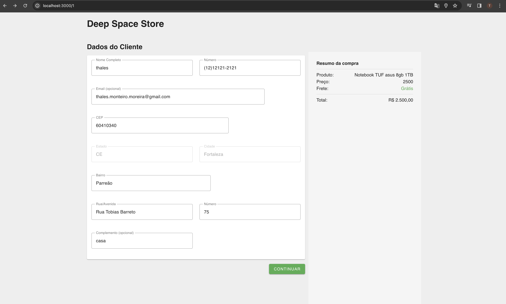

# Projeto de Teste Técnico - Tela de checkout DeepSpaceStore

Este é um projeto desenvolvido como parte de um teste técnico. O projeto consiste em criar uma sequencia de telas de formulário para a simulação de uma compra em telas de checkout.

## Tecnologias Utilizadas
- [Vuejs]: Framework progressivo utlizado para criação de SPA. 
- [VUEX]: Biblioteca para gerenciamento de estado, Utilizei nesse projeto para centralizar o estado entre os componentes e sendo assim tendo uma maior facilidade e dinamismo para o compartilhamento de estados entre toda a aplicação
- [Vuetify]: Biblioteca de componentes UX/UI baseado no materialDesign. Utilizado para construir toda a parte visual da aplicação, obtendo uma maior facilidade no desenvolvimento e rapidez.
- [Vue-router]: Biblioteca oficial de roteamento para aplicativos Vue.js, ele permite a navegação entre diferentes partes da aplicação. Utilizado para fazer a navegação entre paginas.
- [Mock-Service-Worker]: Biblioteca que permite simular uma API em um ambiente de desenvolvimento. Utilizado para mockar e simular uma api RESTFULL onde foi feitas requisições GET e POST.

## Instalação
- Clone o repositório
- navegue até o diretorio do projeto
- execute "npm install" para baixar todas as dependencias
- execute npx msw init .\public\ para inicializar a primeira vez o msw (caso nescessario)
- rode o projeto com npm run dev 
- acesse http://localhost:3000/1

## Telas 

